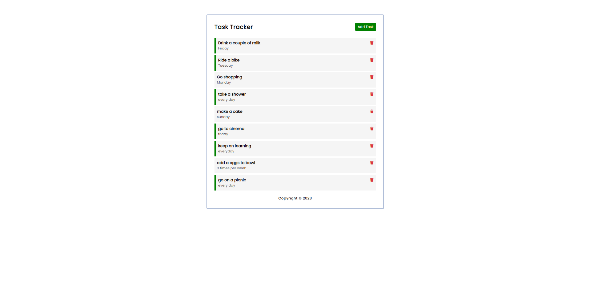
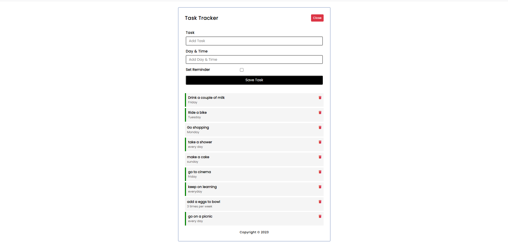

# Todo App  by using Vue JS 

## Project setup
```
npm install
```

### Backend setup
```
npm run backend
```

### Compiles and hot-reloads for development
```
npm run serve
```

### Compiles and minifies for production
```
npm run build
```

### Customize configuration
See [Configuration Reference](https://cli.vuejs.org/config/).





